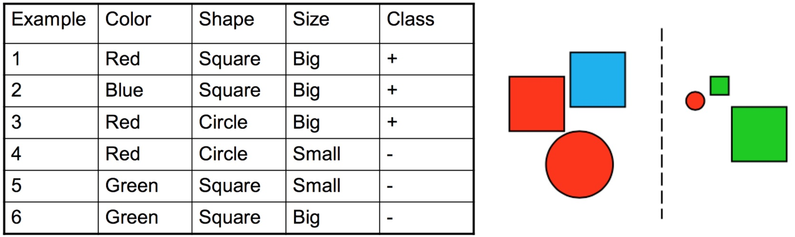
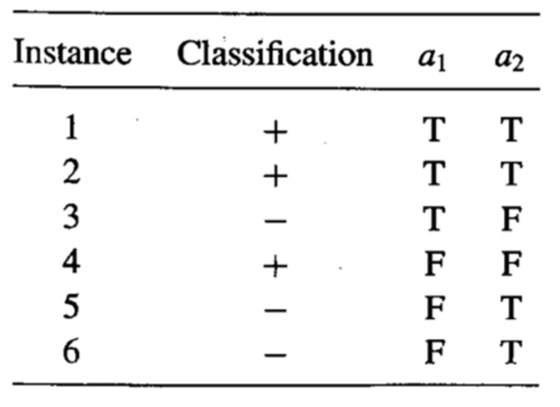
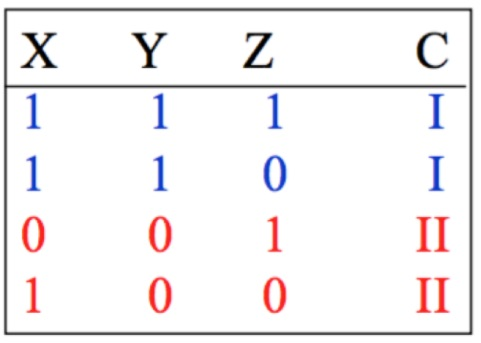

# Quiz Decision Tree

Note that all ~scratch words~ indicate wrong part in the option, and all
_italic_ or __bold__ sentences are notes.

1.  A decision tree of depth 1 is known as a stump. Suppose you have a dataset
    containing 4 Boolean attributes and a Boolwan output variable. How many
    possible stumps can you create?

    -   [ ] 3
    -   [ ] 2
    -   [x] 4
    -   [ ] 6

2.  A decision tree of depth 1 is known as a stump. Suppose you have a dataset
    containing 4 Boolean attributes and a Boolwan output variable. In how many
    ways can you label the stumps?

    -   [x] 8
    -   [ ] 12
    -   [ ] 3
    -   [ ] 4

3.  Suppose you have a deck of ___fair___ cards. The class label of each card
    is its suit. Remember that there are 4 suits in a standard deck of cards -
    diamond, clubs, hearts, and spades. What is the entropy of this deck of
    cards?

    -   [x] 2
    -   [ ] -1
    -   [ ] -2
    -   [ ] 1

4.  Suppose you have a deck of ___unfair___ cards, which has the following suit
    distribution:

        Hearts: 15
        Diamonds: 15
        Clubs: 11
        Spades: 11

    The class label of each card is its suit. Remember that there are 4 suits
    in a standard deck of cards - diamond, clubs, hearts, and spades and the
    total number of cards in a deck is 52.

    Which of the following is true about this deck of cards?

    -   [ ] Its entropy cannot be computed.
    -   [ ] It will have equal entropy as the deck of fair cards.
    -   [ ] It will have higher entropy than the deck of fair cards.
    -   [x] It will have lower entropy than the deck of fair cards.

5.  Suppose you want to send a secret message that will be encoded using 4
    characters - `A`, `B`, `C` and `D`.

    Which of the following would be true? See
    [this](https://en.wikipedia.org/wiki/Entropy_\(information_theory\)) for
    more detail.

    -   [ ] If the probability distribution is skewed and a particular
        character, say A, is more likely than others, then we will require at
        least 2 bits to transmit each character.
    -   [ ] If all the 4 characters are equally likely, then we can code any
        sequence using less then 2 bits per character.
    -   [x] If the probability distribution is skewed and a particular
        character, say A, is more likely than others, then we can devise a
        scheme in which the number of bits needed per character would be less
        than 2.
    -   [ ] If all the 4 characters are equally likely, then we will need at
        least 2 bits to encode each character.

6.  Suppose you have the following dataset (represented in tabular and
    graphical form below.

    

    Which attribute out of {`color`, `shape`, and `size`} would give the best
    infomation gain?

    -   [ ] Shape
    -   [ ] Class
    -   [x] Color
    -   [ ] Size

7.  For the same dataset, which of the following is false?

    -   [x] The best attribute to use for the root node would be shape.
    -   [ ] If we use color as the splitting attribute, then the information
        gain would be greater than 0.
    -   [ ] If we use shape as the splitting attribute, then the information
        gain would be 0.
    -   [ ] The entropy of the entire dataset is 1.

8.  Consider the following dataset:

    

    Which of the following is false?

    -   [ ] Attribute `a1` gives positive information gain.
    -   [ ] The entropy of the entire dataset is 1.
    -   [ ] Attribute `a2` gives 0 information gain.
    -   [x] The best decision tree that would correctly classify this data set
        can have less than 4 leaf nodes.

9.  Suppose you want to represent the following Boolean function:

        Y = A \/ [ B /\ C ]

    where `A`, `B` and `C` are all booleans. Which of the following is/are
    true?

    -   [x] There would be 4 leaf nodes.
    -   [ ] There would be `2^3=8` leaf nodes.
    -   [ ] There would be 7 internal nodes.
    -   [ ] There would be 3 internal nodes.

10. Suppose you have the dataset shown below:

    

    Which of the following is/are true?

    -   [x] The information gain of attribute `Z` is 0.
    -   [x] The information gain of attribute `X` is between 0 and 1.
    -   [x] The dataset can be correctly classifies using a stump.
    -   [x] the information gain of attribute `Y` is 1.
